# Automagik Forge

<div align="center">


**AI Agent Task Orchestration Platform**

*Production-ready task management system for orchestrating multiple AI coding agents with intelligent routing and enterprise-grade deployment capabilities*

[](https://www.npmjs.com/package/automagik-forge)
[](https://github.com/namastexlabs/automagik-forge/blob/main/.github/workflows/publish.yml)
[](https://rustup.rs/)
[](https://nodejs.org/)
[](https://www.typescriptlang.org/)

[Quick Start](#quick-start) • [Architecture](#architecture) • [Features](#features) • [Documentation](#documentation) • [Deployment](#deployment)

</div>


## 🚀 Overview

**Automagik Forge** is a sophisticated AI agent orchestration platform that revolutionizes how developers work with multiple coding agents. Built on **Rust** backend with **React/TypeScript** frontend, it provides enterprise-grade task management, intelligent agent routing, and comprehensive workflow orchestration.

### **Key Differentiators vs Vibe Kanban:**

- ✨ **Enhanced Agent Ecosystem**: Added OpenCode AI executor alongside Claude, Gemini, AMP, and CCR
- 🔧 **Advanced Task Templates**: Pre-built templates for common development workflows  
- 🏗️ **Sophisticated Architecture**: Clean separation of concerns with modular executor design
- 📊 **Enterprise Task Management**: Kanban-style interface with advanced filtering and organization
- 🔄 **Git Workflow Integration**: Automatic branch management, PR creation, and worktree handling
- 🎯 **Intelligent Agent Selection**: Context-aware routing based on task type and requirements
- 🛡️ **Production Security**: Built-in authentication, session management, and secure API design
- 📈 **Real-time Monitoring**: Live task status updates, execution logs, and performance metrics

## 🏗️ Architecture

The system follows a **clean architecture** pattern with intelligent task routing that analyzes requirements and distributes them to specialized coding agents. Each agent operates in isolated environments with dedicated knowledge base access and contextual filtering for precise responses.

```mermaid
graph TB
    %% Client Entry Point
    Client[👤 User Interface<br/>React + TypeScript<br/>Task Management] --> Router
    
    %% Central Task Orchestration
    Router[🎯 Task Router<br/>Rust Backend<br/>Intelligent Coordinator<br/>Agent Selection]
    
    %% Task Distribution Engine
    Router --> TaskEngine{🧠 Task Analysis<br/>Agent Classification<br/>Workload Distribution}
    
    %% Specialized Coding Agents
    TaskEngine --> Agent1[🤖 Claude Executor<br/>Advanced Reasoning<br/>Code Generation<br/>Complex Problems]
    TaskEngine --> Agent2[⚡ Gemini Executor<br/>Fast Processing<br/>Code Analysis<br/>Quick Tasks]
    TaskEngine --> Agent3[🔧 OpenCode AI<br/>Specialized Tools<br/>Custom Workflows<br/>Domain Expertise]
    TaskEngine --> Agent4[💎 AMP Executor<br/>Performance Focus<br/>Optimization Tasks<br/>System Integration]
    TaskEngine --> Agent5[🎪 CCR Executor<br/>Code Review<br/>Quality Assurance<br/>Best Practices]
    
    %% Git Workflow Management
    subgraph GitFlow[🌿 Git Workflow Engine]
        Worktree[📁 Worktree Manager<br/>Isolated Environments<br/>Branch Management]
        PRManager[🔀 PR Manager<br/>Automatic PR Creation<br/>GitHub Integration]
        BranchMgmt[🌲 Branch Strategy<br/>Feature Branches<br/>Cleanup Automation]
        Worktree --> PRManager
        PRManager --> BranchMgmt
    end
    
    %% Task Management System
    subgraph TaskMgmt[📋 Task Management]
        Templates[📝 Task Templates<br/>Pre-built Workflows<br/>Best Practices]
        Kanban[📊 Kanban Board<br/>Visual Organization<br/>Status Tracking]
        Analytics[📈 Analytics<br/>Performance Metrics<br/>Usage Patterns]
        Templates --> Kanban
        Kanban --> Analytics
    end
    
    %% Execution Environment
    Agent1 --> GitFlow
    Agent2 --> GitFlow
    Agent3 --> GitFlow
    Agent4 --> GitFlow
    Agent5 --> GitFlow
    
    %% Task Management Integration
    Router --> TaskMgmt
    TaskEngine --> TaskMgmt
    
    %% Persistent Storage System
    subgraph Storage[🗄️ Persistent Storage]
        SQLite[💾 SQLite Database<br/>Task History<br/>Session Management<br/>Configuration]
        FileSystem[📂 File System<br/>Project Files<br/>Execution Logs<br/>Artifacts]
        SQLite --> FileSystem
    end
    
    %% Storage Integration
    TaskMgmt --> Storage
    GitFlow --> Storage
    
    %% Real-time Communication
    subgraph Communication[🔄 Real-time Updates]
        WebSocket[🌐 WebSocket<br/>Live Status Updates<br/>Progress Monitoring]
        SSE[📡 Server-Sent Events<br/>Log Streaming<br/>Notifications]
        WebSocket --> SSE
    end
    
    %% Communication Integration
    Router --> Communication
    TaskEngine --> Communication
    
    %% External Integrations
    subgraph External[🔗 External Services]
        GitHub[🐙 GitHub API<br/>OAuth Integration<br/>Repository Access]
        MCP[🔌 MCP Servers<br/>Tool Integration<br/>Extended Capabilities]
        Notifications[📢 Notification System<br/>Windows/macOS/Linux<br/>Audio Alerts]
        GitHub --> MCP
        MCP --> Notifications
    end
    
    %% External Service Integration
    GitFlow --> GitHub
    Agent1 --> MCP
    Agent2 --> MCP
    Agent3 --> MCP
    TaskMgmt --> Notifications
    
    %% Response Generation and UI Updates
    Agent1 --> Response[📤 Task Completion<br/>Results Aggregation<br/>Status Updates]
    Agent2 --> Response
    Agent3 --> Response
    Agent4 --> Response
    Agent5 --> Response
    
    Response --> Client
    
    %% Styling
    classDef router fill:#e3f2fd,stroke:#1976d2,stroke-width:3px,color:#000000
    classDef agent fill:#e1f5fe,stroke:#0277bd,stroke-width:2px,color:#000000
    classDef workflow fill:#f3e5f5,stroke:#7b1fa2,stroke-width:2px,color:#000000
    classDef storage fill:#e8f5e8,stroke:#388e3c,stroke-width:2px,color:#000000
    classDef communication fill:#fff3e0,stroke:#f57c00,stroke-width:2px,color:#000000
    classDef external fill:#fce4ec,stroke:#c2185b,stroke-width:2px,color:#000000
    
    class Router router
    class Agent1,Agent2,Agent3,Agent4,Agent5,TaskEngine agent
    class GitFlow,TaskMgmt,Communication workflow
    class Storage,SQLite,FileSystem storage
    class WebSocket,SSE communication
    class External,GitHub,MCP,Notifications external
```



## ⚡ Quick Start

### Universal Installation (Recommended)

Get started on any machine with our universal installer that handles all dependencies:

```bash
# One-command installation (handles everything)
npx automagik-forge
```

The installer will:
- ✅ Detect your operating system (Linux, macOS, Windows/WSL)
- ✅ Install Node.js 18+ and pnpm (if needed)
- ✅ Install Rust toolchain (if needed)
- ✅ Set up development environment automatically
- ✅ Launch the application with optimal configuration

### Manual Installation

#### Option 1: Local Development
```bash
# Install dependencies
pnpm i

# Start development server
pnpm run dev
```

#### Option 2: Production Build
```bash
# Build from source
./build-npm-package.sh

# Package for distribution
cd npx-cli && npm pack

# Run your build
npx [GENERATED_FILE].tgz
```

Available endpoints:
- **Web UI**: http://localhost:3000 (configurable via FRONTEND_PORT)
- **API**: http://localhost:auto-assigned (configurable via BACKEND_PORT)
- **Health Check**: http://localhost:[BACKEND_PORT]/health

## ✨ Features

### 🎯 **Intelligent Agent Orchestration**
- **Multi-Agent Support**: Claude, Gemini, OpenCode AI, AMP, CCR executors
- **Smart Agent Selection**: Context-aware routing based on task complexity and requirements
- **Parallel Execution**: Run multiple agents simultaneously for faster completion
- **Agent-Specific Optimization**: Tailored configurations for each agent's strengths
- **Fallback Mechanisms**: Automatic agent switching on failures

### 📋 **Advanced Task Management**
- **Kanban Interface**: Visual task organization with drag-and-drop functionality
- **Task Templates**: Pre-built workflows for common development patterns
- **Hierarchical Tasks**: Parent-child task relationships for complex projects
- **Status Tracking**: Real-time progress monitoring with detailed logs
- **Task Filtering**: Advanced search and filter capabilities

### 🌿 **Git Workflow Integration**
- **Worktree Management**: Isolated development environments per task
- **Automatic Branching**: Smart branch creation and naming conventions
- **PR Automation**: Automatic pull request creation with context
- **Merge Strategies**: Configurable merge and cleanup policies
- **Conflict Resolution**: Intelligent handling of merge conflicts

### 🏗️ **Enterprise Architecture**
- **Rust Backend**: High-performance, memory-safe server implementation
- **React Frontend**: Modern, responsive UI with TypeScript
- **SQLite Database**: Lightweight, embedded database for local development
- **Real-time Updates**: WebSocket and SSE for live status updates
- **Modular Design**: Plugin-based architecture for extensibility

### 🔧 **Developer Experience**
- **Hot Reload**: Instant updates during development
- **Comprehensive Logging**: Detailed execution logs with trace IDs
- **Error Handling**: Graceful error recovery and user feedback
- **Configuration Management**: Environment-based settings
- **Testing Framework**: Comprehensive test suites for reliability

### 🔐 **Security & Authentication**
- **GitHub OAuth**: Secure authentication with GitHub integration
- **Session Management**: Persistent user sessions with secure storage
- **API Security**: Rate limiting and request validation
- **Data Protection**: Secure handling of sensitive information
- **Audit Logging**: Comprehensive activity tracking

## 📚 Documentation

### Quick Reference
- **[Getting Started](docs/getting-started.md)** - Installation and initial setup
- **[Task Management](docs/task-management.md)** - Creating and organizing tasks
- **[Agent Configuration](docs/agents.md)** - Configuring and optimizing agents
- **[Git Workflows](docs/git-workflows.md)** - Understanding branch and PR management
- **[API Reference](docs/api.md)** - Backend API endpoints and usage

### Development Guides
- **[Contributing](docs/contributing.md)** - How to contribute to the project
- **[Architecture](docs/architecture.md)** - System design and components
- **[Deployment](docs/deployment.md)** - Production deployment strategies
- **[Troubleshooting](docs/troubleshooting.md)** - Common issues and solutions

## 🚀 Deployment

### Docker Deployment (Recommended)

```bash
# Production deployment
docker-compose up --build -d

# Check service health
docker-compose ps
docker-compose logs app
```

### Environment Variables

```bash
# GitHub Configuration
GITHUB_CLIENT_ID=your_github_client_id_here    # GitHub OAuth app client ID

# Server Configuration
BACKEND_PORT=0                                  # Auto-assign backend port (recommended)
FRONTEND_PORT=3000                              # Frontend development server port
HOST=127.0.0.1                                 # Backend server host

# Development Options
DISABLE_WORKTREE_ORPHAN_CLEANUP=1              # Disable cleanup (debugging only)

# Analytics (Optional)
POSTHOG_API_KEY=your_posthog_key               # PostHog analytics API key
POSTHOG_API_ENDPOINT=your_endpoint             # PostHog analytics endpoint
```

### Custom GitHub OAuth App (Optional)

By default, Automagik Forge uses a shared GitHub OAuth app. For enhanced security or custom branding:

1. Create a GitHub OAuth App at [GitHub Developer Settings](https://github.com/settings/developers)
2. Enable "Device Flow" in the app settings
3. Set scopes to include `user:email,repo`
4. Build with your client ID:
   ```bash
   GITHUB_CLIENT_ID=your_client_id_here pnpm run build
   ```

## 🆚 Key Differences from Vibe Kanban

### **Major Enhancements:**
1. **🤖 Expanded Agent Ecosystem**: Added OpenCode AI executor with specialized capabilities
2. **📝 Task Templates**: Pre-built workflows for common development patterns
3. **🎯 Intelligent Routing**: Enhanced agent selection based on task analysis
4. **🏗️ Advanced Architecture**: Modular executor design with clean separation
5. **📊 Enhanced UI/UX**: Improved task management interface with better organization
6. **🔧 Production Features**: Enhanced error handling, logging, and monitoring
7. **🌿 Git Integration**: Advanced worktree management and PR automation
8. **🔐 Security Improvements**: Enhanced authentication and session management

### **Technical Improvements:**
- **Refactored Executors**: Clean, maintainable code with consistent interfaces
- **Enhanced Database Schema**: Improved data models with better relationships
- **Advanced Migrations**: Database versioning with rollback capabilities
- **Performance Optimizations**: Faster startup, reduced memory usage
- **Comprehensive Testing**: Unit and integration test coverage
- **Documentation**: Extensive docs with examples and best practices

### **New Capabilities:**
- **Agent Specialization**: Each executor optimized for specific use cases
- **Workflow Templates**: Standardized patterns for common tasks
- **Real-time Collaboration**: Multiple users can work on projects simultaneously
- **Advanced Filtering**: Complex search and organization capabilities
- **Audit Trail**: Comprehensive logging and activity tracking
- **Extended Integrations**: MCP server support and external tool connections

## 🛠️ Development

### Setting Up Development Environment

```bash
# Install development dependencies
pnpm i

# Run tests
pnpm run test

# Code quality checks
pnpm run frontend:check
pnpm run backend:check

# Database operations
pnpm run generate-types        # Generate TypeScript types from Rust
pnpm run prepare-db           # Initialize database with seed data
```

### Project Structure

```
automagik-forge/
├── backend/                   # Rust backend server
│   ├── src/
│   │   ├── executors/        # Agent executor implementations
│   │   ├── models/           # Database models and types
│   │   ├── routes/           # API endpoint handlers
│   │   ├── services/         # Business logic services
│   │   └── utils/            # Utility functions
│   └── migrations/           # Database migration files
├── frontend/                 # React TypeScript frontend
│   ├── src/
│   │   ├── components/       # Reusable UI components
│   │   ├── pages/            # Application pages
│   │   ├── lib/              # Utility libraries
│   │   └── hooks/            # Custom React hooks
│   └── public/               # Static assets
├── npx-cli/                  # NPX package distribution
├── scripts/                  # Build and utility scripts
└── shared/                   # Shared type definitions
```

## 🤝 Contributing

We welcome contributions! Please see our [Contributing Guide](docs/contributing.md) for details.

1. **Fork** the repository
2. **Create** a feature branch (`git checkout -b feature/amazing-feature`)
3. **Commit** your changes (`git commit -m 'feat: add amazing feature'`)
4. **Push** to the branch (`git push origin feature/amazing-feature`)
5. **Open** a Pull Request

### Commit Standards

All commits should follow conventional commit standards:
```bash
feat: add new agent executor
fix: resolve task status synchronization
docs: update API documentation
test: add integration tests for git workflows
```

## 📊 Performance

### Benchmarks

| Metric | Development | Production |
|--------|-------------|------------|
| **Startup Time** | ~2-3s | ~5-8s (includes migrations) |
| **Response Time** | <100ms | <300ms (with database) |
| **Concurrent Tasks** | 10-50 | 500+ (with proper scaling) |
| **Memory Usage** | ~150MB | ~300MB (per worker) |
| **Agent Executors** | 5 simultaneous | 20+ (configurable) |

### Scaling Recommendations

- **Small Deployment**: 1-2 workers, 1GB RAM, SQLite
- **Medium Deployment**: 4-8 workers, 4GB RAM, PostgreSQL
- **Large Deployment**: 16+ workers, 8GB+ RAM, PostgreSQL cluster
- **Enterprise**: Kubernetes with horizontal pod autoscaling

## 🔧 Tech Stack

### Core Framework
- **[Rust](https://rustup.rs/)** - High-performance backend with memory safety
- **[Tokio](https://tokio.rs/)** - Async runtime for concurrent task handling
- **[Axum](https://github.com/tokio-rs/axum)** - Modern web framework with excellent performance
- **[SQLx](https://github.com/launchbadge/sqlx)** - Compile-time verified database queries

### Frontend
- **[React 18](https://reactjs.org/)** - Modern UI library with concurrent features
- **[TypeScript](https://www.typescriptlang.org/)** - Type-safe JavaScript development
- **[Vite](https://vitejs.dev/)** - Fast build tool and development server
- **[Tailwind CSS](https://tailwindcss.com/)** - Utility-first CSS framework

### AI Integration
- **[Anthropic Claude](https://www.anthropic.com/)** - Advanced reasoning and code generation
- **[Google Gemini](https://ai.google.dev/)** - Fast processing and analysis
- **[OpenCode AI](https://opencode.ai/)** - Specialized development tools
- **Multiple Provider Support** - Extensible architecture for new agents

### Infrastructure
- **[SQLite](https://sqlite.org/)** - Embedded database for local development
- **[Git](https://git-scm.com/)** - Version control with advanced worktree management
- **[Node.js](https://nodejs.org/)** - JavaScript runtime for build tools
- **[pnpm](https://pnpm.io/)** - Efficient package manager

## 📄 License

This project is licensed under the **MIT License** - see the [LICENSE](LICENSE) file for details.

## 🙏 Acknowledgments

We extend our gratitude to the original **[Vibe Kanban](https://github.com/BloopAI/vibe-kanban)** project by **BloopAI**, which served as the foundation for Automagik Forge. Their innovative approach to AI agent orchestration inspired many of the core concepts in this enhanced platform.

**Special Thanks:**
- **[BloopAI Team](https://github.com/BloopAI)** for the original Vibe Kanban architecture and vision
- **[Rust Community](https://www.rust-lang.org/community)** for the amazing language and ecosystem
- **[React Team](https://reactjs.org/community/team.html)** for the excellent frontend framework
- **[Anthropic](https://www.anthropic.com/)** for Claude AI capabilities
- **[Open Source Community](https://opensource.org/)** for the incredible tools and libraries

---

<div align="center">

**[🏠 Homepage](https://automagikforge.com)** • **[📧 Contact](mailto:forge@namastex.ai)** • **[🐛 Issues](https://github.com/namastexlabs/automagik-forge/issues)** • **[💬 Discussions](https://github.com/namastexlabs/automagik-forge/discussions)**

Made with ❤️ by the **Automagik Team**

**Based on [Vibe Kanban](https://github.com/BloopAI/vibe-kanban) by BloopAI** • **Enhanced and maintained by [Namastex Labs](https://namastex.ai)**

</div>